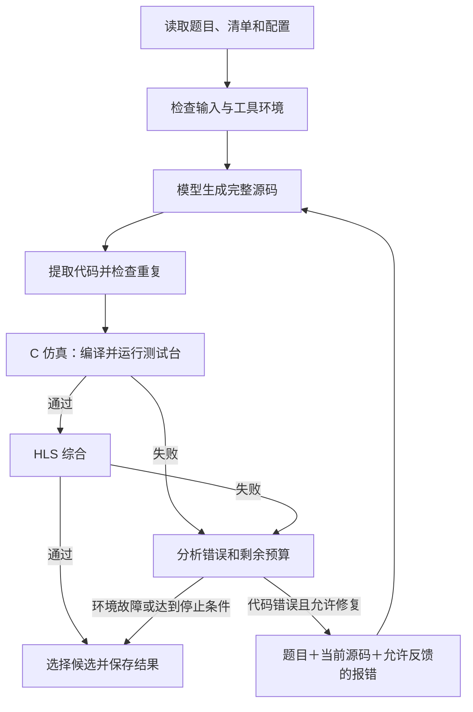

# HLS Agent 设计与工作原理

更新日期：2026-09-16。本文描述当前首版实现，后续计划集中放在最后一节。

**一句话理解：Agent 让模型生成 HLS C++，用 Vitis 检查结果，再根据报错决定是否修复，最后交付验证证据最好的候选代码。**

阅读建议：先看第 1～3 节理解整体；开发模块时看第 4～6 节；查看运行结果时看第 7 节。命令和参数示例见 [使用说明](README.md)。

## 1. Agent 在项目中负责什么

项目分为四部分：

| 位置 | 职责 | 可以怎样理解 |
|---|---|---|
| `agent/` | 安排生成、验证、修复和停止，选择最终代码 | 负责决策的控制器 |
| `serve/` | 把请求发送给模型并保存回复 | 模型调用接口 |
| `evaluation/` | 读取任务材料，执行 Vitis，整理验证结果 | 代码验证工具 |
| `skill/` | 保存可复用的修复知识 | 供检索的规则库 |

当前采用单控制器、顺序执行的结构。控制器按明确规则做决定；模型负责写代码；Vitis 提供编译、测试和综合证据。

比赛背景强调“智能体相对同模型裸跑的提升”，所以首版优先实现正确性验证和有限修复。位宽压缩、资源优化、多角色讨论等能力暂未加入主流程，是否添加要由后续实验决定。

## 2. 目录结构：每类功能放在哪里

以下文件均已实现。图中省略 `__init__.py` 和各目录的 README。

```text
agent/
├── interface/
│   └── entry.py          # 入口：读取参数、准备输入、启动控制器
├── core/
│   ├── contracts.py      # 模块之间共用的数据结构和接口
│   ├── controller.py     # 主流程：生成 → 验证 → 修复 → 交付
│   └── policy.py         # 决策：是否还有预算、是否应停止
├── context/
│   ├── builder.py        # 组装发送给模型的题目、源码和报错
│   └── skills.py         # 按错误检索规则，默认关闭
├── feedback/
│   └── diagnostics.py    # 识别错误类型，生成用于比较的错误指纹
├── candidates/
│   └── manager.py        # 管理代码版本、去重、选择最终版本
├── artifacts/
│   └── writer.py         # 保存请求、日志、快照和结果
└── config/
    └── policy.json       # 修复次数、停止阈值等策略参数
```

其中几个容易混淆的边界：

- `core/policy.py` 写“如何决定”的逻辑，`config/policy.json` 写“最多修几次”等参数。
- `feedback/` 判断发生了什么错误，`core/policy.py` 决定下一步做什么。
- `candidates/` 决定选哪个代码版本，`artifacts/` 负责将版本和记录保存到磁盘。
- `context/skills.py` 是检索代码；实际知识位于项目根目录的 `skill/`。
- `agent/candidates/`、`agent/artifacts/` 都是源码目录。运行生成的文件写入用户指定的输出目录。

Agent 还调用以下项目模块：

| 文件 | 用途 |
|---|---|
| `serve/agent_model.py` | 在有时间限制的子进程中请求模型 |
| `serve/inference.py` | 发送实际的模型 API 请求 |
| `serve/code.py` | 提取完整源码，处理单层 Markdown 代码围栏 |
| `evaluation/task_io.py` | 读取题目、清单和明确声明的依赖 |
| `evaluation/validator.py` | 为每个候选准备独立工作目录，整理验证证据 |
| `evaluation/hls.py` | 启动 Vitis，执行仿真、综合及超时处理 |

入口组装这些组件，再交给控制器。组件通过公共数据结构传递结果，不自行启动另一轮 Agent。

## 3. 一道题如何运行

### 3.1 先根据输入决定能验证到哪一步

是否提供任务清单，决定了实际执行范围：

| 输入 | 当前执行行为 | 验证范围 `validation_scope` |
|---|---|---|
| 只有题目文本 | 生成完整候选，不调用 Vitis | `none` |
| 题目＋清单，清单包含测试台 | C 仿真通过后再综合；失败时按规则修复 | `public_tests_and_synthesis` |
| 题目＋清单，清单没有测试台 | 根据清单中的顶层函数和依赖执行综合 | `synthesis_only` |

当前不会从题目文字中自动推导完整验证工程，也不会自动生成测试台。希望运行 HLS，必须显式提供 `--task-manifest`。

### 3.2 完整验证模式的流程



图中的每个新候选都要重新验证。即使只是为了解决综合错误而修改代码，也要先重新做 C 仿真，确认没有破坏功能。

输入不合法、工具不可用、模型请求失败、输出格式有歧义等情况也会停止，并留下失败记录。最后能否交付候选，要看此前是否已获得完整代码。

### 3.3 一个已经跑通的例子

人工题目要求实现 `kernel(a) = a + 1`：

1. 模拟模型第一次返回含未定义变量的代码。
2. Vitis 编译失败，控制器把允许公开的报错交给模型。
3. 模拟模型第二次返回正确代码，形成新候选。
4. 新候选通过 C 仿真和 HLS 综合，控制器停止并交付它。

这次运行用了 **2 次模拟模型请求、3 次实际 HLS 调用**。它验证了工程流程；真实模型在比赛题上的修复效果还需要单独测量。

## 4. 输入、配置与模块间的数据

### 4.1 入口

Windows 和 Linux 入口调用相同的 Python 模块：

```text
run_agent.ps1 / run.sh
        ↓
python -m agent.interface.entry
        ↓
agent/core/controller.py
```

主要输入为：

- 题目文本和一个尚不存在的输出目录；
- `--config`：共享的模型与 HLS 运行配置；
- `--task-manifest`：可选的公开任务清单；
- `--policy`：可选的 Agent 策略配置；
- `--run-id`：可选的运行编号，配对运行时由启动器提供。

新入口默认读取 `serve/runtime.json`。使用本机配置时，应显式传入 `--config serve/runtime.local.json`。

旧 `run_eval.ps1` 仍可使用，内部已接到同一控制器。它保留本机配置优先、要求测试台、支持 `--source` 验证已有代码等行为。旧入口首次生成保留原题文本模式；严格比赛裸基线仍应使用独立的 `run_baseline.sh`。

### 4.2 清单决定“哪些文件能用、哪些信息能给模型”

清单声明顶层函数、候选文件名、测试台、头文件等依赖。文件路径相对于清单目录，加载器检查缺失文件、越界路径和文件名冲突。

与模型可见性直接相关的字段只有以下两项：

| 字段 | 默认值 | 含义 |
|---|---|---|
| `model_visible` | `[]` | 允许把内容放进提示词的依赖文件名单 |
| `feedback_policy` | `category_only` | 默认只反馈错误类别；显式设为 `public_diagnostics` 时允许提供工具诊断文本 |

题目原文本身会提供给模型。未列入 `model_visible` 的依赖仍可用于验证，但不会直接放入提示词；实际清单没有单独的 `validator_only` 字段。

例如，可以让验证器运行 `tb.cpp`，只将 `api.h` 中的公开接口提供给模型。是否允许反馈测试日志，需要另行设置 `feedback_policy`。正式隐藏测试与参考答案不作为 Agent 自动读取的材料。

### 4.3 两种配置分别管理

| 配置 | 管理内容 |
|---|---|
| 共享运行配置，由 `--config` 指定 | 模型地址、模型名、生成参数、上下文上限、Vitis 路径、器件、时钟、各阶段超时 |
| `agent/config/policy.json`，或 `--policy` 指定的文件 | 修复次数、停滞阈值、验证预留时间、技能开关等策略 |

每次运行保存配置快照和哈希。哈希可以理解为内容的“指纹”，用来检查记录与实际输入是否一致。

Agent 及模型工作进程使用冻结配置模式，避免 `LLM_*` 环境变量在运行中覆盖共享快照。默认策略不会自行更换模型或调整采样参数。

### 4.4 组件传递哪些数据

公共类型定义在 `core/contracts.py`：

| 类型 | 保存什么 |
|---|---|
| `Material`、`TaskSpec` | 题目、清单、依赖内容及其模型可见性 |
| `PromptBundle` | 提示词、材料来源、上下文预算记录和选中的技能 |
| `Candidate` | 某一版完整代码、父版本、源码哈希及验证结果 |
| `ValidationResult` | 被验证的代码/任务/工具配置哈希、阶段结果及允许反馈的文本 |
| `Diagnostic` | 错误类别、阶段、位置和错误指纹 |
| `Budget` | 总截止时间、已派发的模型请求数及工具调用数 |

模型返回结果和最终回执使用字典；当前没有独立的 `AgentResult` 或 `GenerationResult` 类。控制器返回 `(退出码, 结果字典)`。

## 5. 什么时候修复，什么时候停止

### 5.1 默认参数

以下数值来自当前 `agent/config/policy.json`，是初版默认值，不是比赛官方限额。

| 参数 | 默认值 | 作用 |
|---|---:|---|
| `max_repairs` | 2 | 首次生成之后，最多再请求两次修复 |
| `stagnation_limit` | 2 | 连续两次出现同一错误指纹且验证等级未提高时停止 |
| `validation_reserve_seconds` | 30 秒 | 剩余时间不超过此值时，不再发起修复 |
| `cleanup_reserve_seconds` | 2 秒 | 从工具与生成可用预算中预留收尾时间 |
| `skills_enabled` | `false` | 默认不检索技能 |
| `max_skills` | 2 | 启用检索时，最多选择两条匹配规则 |
| `diagnostic_max_chars` | 4000 | 提示词中的诊断文本长度上限 |
| `context_safety_tokens` | 512 | 上下文估计时额外预留的额度 |

从题目开始生成时，默认最多 3 次模型请求；如果每个候选都执行仿真和综合，最多 6 次主要 HLS 调用。失败或重复会更早结束。

30 秒预留只是决定“还要不要修复”的阈值，并不保证剩余时间一定足够完成验证。每一步仍受运行配置中的阶段超时和剩余总时间约束；配对启动器另有总预算加 20 秒清理余量的外层超时限制。

### 5.2 不同情况的处理

| 情况 | 当前动作 |
|---|---|
| 编译、公开功能测试或综合失败 | 在预算允许时构造修复提示词，要求返回完整新源码 |
| 路径、依赖、许可证、模型服务等故障 | 停止并记录基础设施失败 |
| 模型、工具或总时间超限 | 停止，不自动增加预算 |
| 新源码与已有候选完全相同 | 记录重复，不重复跑工具 |
| 源码不同，但同一报错连续无进展 | 达到停滞阈值后停止 |
| 返回多个含糊代码块、空代码或截断回复 | 不拼接、不猜测、不自动续写 |
| 所需验证全部通过 | 立即停止 |
| 修复次数用完或验证预留时间不足 | 停止，选择已有候选 |

错误指纹来自规范化后的报错，用于比较两轮错误是否相似。它是控制成本的启发式判断，不能证明问题无法修复。

如果后续响应格式失败、生成截断或上下文超限，但此前已有完整候选，可以保留并交付旧候选；没有候选时则交付失败。基础设施失败仍返回非零，不能用旧候选掩盖故障。

## 6. 发给模型什么，最后选哪份代码

### 6.1 提示词

首次生成包含：源码输出要求、题目、目标器件与时钟，以及清单明确公开的顶层函数和依赖内容。

修复请求在此基础上加入：

1. 当前完整源码；
2. 允许反馈的错误类别或诊断文本；
3. 启用检索后选中的少量规则。

当前每次请求独立组装，不自动带入所有历史对话。每段材料的来源和哈希保存在 `context.json`。

上下文过长时，先移除选中的技能，再缩短诊断文本；题目、公开接口材料和当前源码不会被静默截断。必要材料仍超限时停止。

**当前预算使用 UTF-8 字节数作保守估计，不是精确 token 计数。** 记录中标记 `token_count_verified=false`。接入模型专用 tokenizer 和对话模板后，才能精确计算；服务端实际溢出仍按失败处理。

### 6.2 技能检索

`context/skills.py` 已实现按错误类别和关键词筛选规则，默认关闭。启用时读取 `skill/rules/` 或 `--skills-dir` 指定目录下的 JSON 文件，按固定文件顺序选择匹配项。

条目需要包含版本、Vitis 版本、适用条件、失败条件、来源、许可和独立验证声明。代码检查这些字段与声明，但不会重新执行声明中的验证实验。因此，规则质量仍需通过真实开发实验确认。

当前没有随首版交付一套宣称有效的比赛修复规则。运行期间技能包只读，不能从当前评测题的失败结果自动学习并修改规则。

### 6.3 候选选择

每次获得一份完整新源码，就登记为一个候选。每个候选独立验证，修改代码后不继承上一版的通过状态。

在同一任务和验证范围内，当前优先级从高到低为：

1. 功能测试和综合均通过；
2. 功能测试通过；
3. 有明确的编译通过证据；
4. 仅综合通过；
5. 尚无上述通过证据的完整代码。

同等级选择较早的候选，避免默认认为“最后一版最好”。没有测试台时，仅综合通过不能当作功能正确。

例如，0 号候选功能通过但综合失败，1 号候选修复后反而编译失败，最终会保留 0 号候选，同时如实记录其综合仍未通过。

## 7. 如何看运行结果

### 7.1 文件位置

```text
<output_directory>/
├── problem.txt、config.json、policy.json  # 本次输入和配置快照
├── task.json、materials/                 # 任务信息与依赖快照
├── candidate.cpp                         # 最终选中的源码，有候选时才生成
├── result.json                           # 结果汇总
├── events.jsonl                          # 按时间记录的调用和决策
└── candidates/
    ├── 000/                              # 第一次生成或已有源码
    │   ├── candidate.cpp
    │   ├── prompt.txt、request.json       # 有模型请求时保存
    │   ├── response.txt、context.json     # 回复、来源与预算记录
    │   ├── validation.json               # 有验证时保存
    │   └── work/                         # TCL、日志、综合报告与 RTL
    └── 001/...                           # 后续修复尝试
```

失败可能发生在某个阶段之前，因此并非每次运行都有全部文件。每条验证证据都绑定源码、任务材料和工具配置的哈希，避免混用旧报告。

### 7.2 先看这几个字段

| 字段 | 回答的问题 |
|---|---|
| `status`、`exit_code` | 是否成功交付候选，是否发生运行故障？ |
| `validation_scope` | 这次检查了哪些内容？ |
| `validation_status`、`checks` | 在这个范围内，哪些检查通过了？ |
| `selected_candidate` | 最终选择了哪一版？ |
| `stop_reason`、`category` | 为什么停止，有什么错误？ |
| `generation_requests`、`tool_calls` | 派发了多少次模型请求、进行了多少次主要 HLS 调用？ |

`checks` 对应四项：`parse`（解析）、`compile`（编译）、`run`（测试运行）、`synthesize`（综合）。当前解析与编译主要从 Vitis C 仿真日志共同观察，没有独立的官方解析评分步骤；证据不足时保留 `unknown` 或 `not_run`。

**新 Agent 入口的退出码 0，只表示成功交付了完整候选。** 常见情况如下：

| 情况 | `status` | 退出码 | 怎样理解 |
|---|---|---:|---|
| 没有清单，只生成代码 | `generated_unvalidated` | 0 | 有代码，未验证 |
| 仅综合通过 | `generated_unvalidated` | 0 | 综合范围通过，功能未验证 |
| 修复用完，交付仍未通过验证的候选 | `generated` | 0 | 有代码，但不是通过的解答 |
| 功能与综合均通过 | `passed` | 0 | 在提供的测试范围内通过 |
| 无完整候选或发生基础设施故障 | `failed` | 非零 | 运行失败；可能保留旧候选供诊断 |

判断是否通过必须结合验证范围。旧 `run_eval.ps1` 保留不同语义：功能测试与综合均通过才返回 0。

请求记录也区分“已派发”“确认发送”和“服务结果未知”。工作进程被终止或响应丢失时，不会把缺少响应元数据简单算成零调用。

## 8. 怎样与裸基线比较

配对入口运行两条独立分支：

| 分支 | 行为 |
|---|---|
| 裸基线 `run_baseline.sh` | 原题文本、一次模型请求，不用技能、不进行工具反馈修复 |
| Agent `run.sh` | 同模型配置，加上上下文组织、验证及有限修复 |

两者共享题目、模型配置和运行编号。Agent 不读取裸基线的输出当作初始解。配对启动器还保存公开验证材料、策略和启用的技能包快照，并核对返回的哈希。

`pair.json` 中的配对成功，表示两条分支运行及输入核对完成，不代表题目答对。比较正确率时，还要用相同的独立评测标准检查两条分支交付的代码，并分别记录耗时与调用成本。

后续实验建议依次比较：

1. 裸基线；
2. 普通反馈修复的 Agent；
3. 在相同预算下增加规则检索的 Agent。

内部修复次数与外层 `pass@1/pass@5` 分开记录，不能把“修复了五次”称为 pass@5。具体采样统计遵循赛事最终协议。

项目已有题集按 [基线协议](../report/baseline_protocol.md) 冻结。开发新策略和技能时，应使用另建的独立开发题，不能依据冻结题的失败结果反复调整方案。

## 9. 当前验证结果与下一步

### 已完成

- 30 项智能体测试、5 项基线测试通过，覆盖修复、回归、去重、停滞、预算、输入边界与配对运行。
- 使用本机模拟模型服务和实际 Vitis，跑通“编译失败 → 修复 → C 仿真通过 → 综合通过”，耗时约 83 秒。
- 已提供 Windows/Linux 入口、运行证据和旧评测命令兼容入口。

以上结果来自首版实现时的验证，详细记录见 [实现与验证报告](../report/agent_implementation.md)。它们证明工程链路可工作，尚不证明真实模型的比赛收益。

### 后续工作

| 工作 | 要回答的问题 |
|---|---|
| 精确上下文计数 | 输入、输出及对话模板是否确实装得进模型上下文？ |
| 独立开发题上的策略与技能实验 | 相对固定裸基线提高了多少通过率，又增加了多少时间？ |
| AMD/ROCm 单卡和断网容器验证 | 模型、Vitis 和 Agent 能否在最终环境一键运行？ |
| 官方评测接口与 pass@k 对接 | 输出、采样、统计和冻结要求是否符合最终协议？ |

设计依据包括 [项目背景](F:/Projects/ADMCmpt/docs/background.txt)、[讲座笔记](F:/Projects/ADMCmpt/docs/AMD讲座_整理笔记.md) 和 [HLS 修复论文阅读记录](F:/Projects/ADMCmpt/docs/ReadReference/01_28_HLS_Repair.md)。本文以当前本地代码说明系统行为，比赛规则仍以后续官方细则为准。
