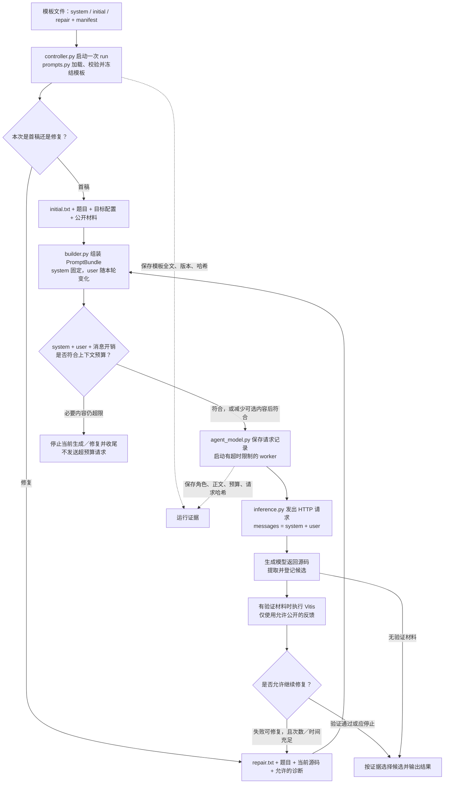

# System prompt 接入 Agent：程序流程

这张图描述已实现的标准 Agent 请求路径。核心是：**一次运行只加载一份模板快照，每次生成都发送同一份 system，当轮 user 内容随首稿／修复变化。** 当前没有 RAG 调用。



## 对照代码阅读

| 程序位置 | 负责什么 | 不负责什么 |
| --- | --- | --- |
| `agent/prompts/` | 可编辑的英文模板与版本 | 不决定何时修复 |
| `agent/context/prompts.py` | 加载文本、校验版本、生成不可变快照 | 不调用模型 |
| `agent/core/controller.py` | 每次 run 加载一次；组织生成、验证和修复 | 不在每轮重新读取模板 |
| `agent/context/builder.py` | 按阶段构造 user，携带共享 system，检查总预算 | 不放入隐藏测试材料 |
| `serve/agent_model.py` | 保存本次请求；在限时 worker 中调用传输层 | 不把 system 拼成 user 文本 |
| `serve/inference.py` | 构造带角色的 messages，发送 HTTP，记录结果 | 不自行运行 Vitis |

预算采用保守 UTF-8 字节估算，不是精确 tokenizer 计数。超限时先移除可选技能，再缩短诊断；不静默截断题目、当前源码或 system。服务端仍需使用与生成模型匹配的 chat template。

## 首稿与修复的区别

```text
首稿请求                         修复请求
system: 同一份 system.txt         system: 同一份 system.txt
user:   initial 阶段指令          user:   repair 阶段指令
        题目／配置／公开材料              题目／配置／公开材料
                                        当前代码／允许的诊断
```

修复箭头回到“构造本轮 user”，不会回到“重新加载模板”。每次 HTTP 请求都会再次发送 system；模型服务无需记住前一轮。

## 从哪里查看实际输入

- 运行根目录 `prompt_templates.json`：这一轮运行冻结的三份模板、版本及哈希。
- `candidates/NNN/system_prompt.txt`：当次 system 文本。
- `candidates/NNN/prompt.txt`：当次 user 文本。
- `candidates/NNN/request.json`：实际请求参数和消息角色。
- `candidates/NNN/context.json`：来源、阶段、预算与消息哈希。
- `candidates/NNN/response.txt.meta.json`：请求结果及传输消息哈希。

模板加载失败、工具环境异常、请求失败、重复候选等停止条件在主流程另有处理，本图只突出 system prompt 的接入路径。

## 三个兼容边界

1. 严格裸基线：继续原题单条 user，不经过上述 Agent 模板组装。
2. 旧评测 `raw_initial=True`：首稿无 system；修复才使用 system + repair。
3. 提供 `initial_source`：跳过首稿模型请求，先验证现成代码；需要修复时进入 repair 分支。

可编辑画布位于项目的 `docs/Mind/system-prompt-flow.canvas`；总体位置见 `docs/Mind/agent-flow.canvas`。版本和测试说明见 [提示词说明](zcomp/agent/prompts/README.md)。
