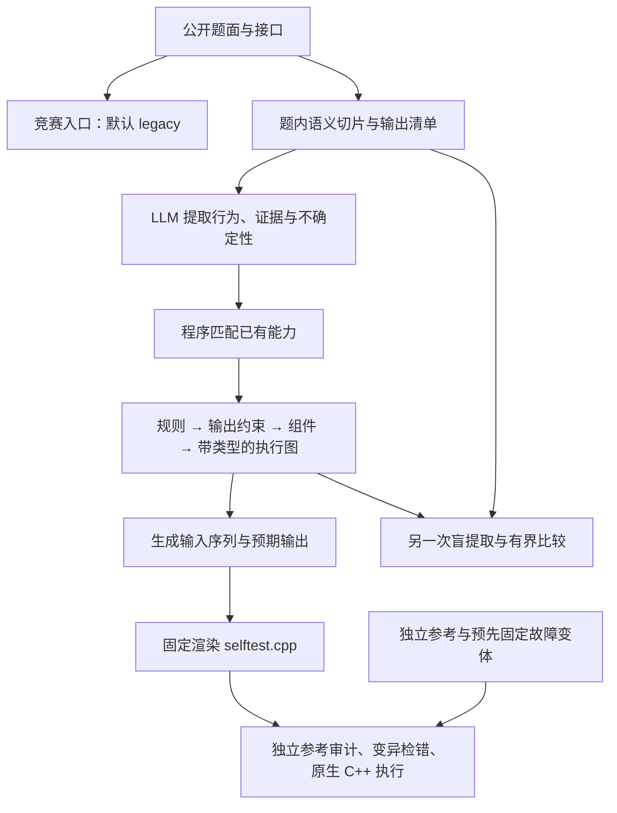

# Bench4HLS 测试台模块结构与行为前端 v4

更新：2026-09-26。当前同时保留竞赛默认路径和契约实验路径。v4 是实验 runner 的
`--representation behaviors`，尚未替换默认入口，生成结果仍为 `generated_unreviewed`。

本轮新变体评估已经完成：支持范围内 v3 为 24/24、v4 为 23/24，v4 一次共同误读
奇偶规则被独立参考与原生执行检出；两版各 12 次负例均弃权。v4 保持实验状态，
详见 [评估结果](../../report/evaluations/bench4hls_behavior_matching_v4_20260926.md)。

在这份冻结评估之后，新增了可选的 [独立有限参考验收入口](BENCH4HLS_REFERENCE_GATE.md)：
对保存的草稿进行外部参考核对，也可通过生成包装 API 在生成后调用。原 v4 生成逻辑
保持冻结；参考一致结果仍需审查，不能自动验收候选。

## 三层结构



盲提取只接收同一份公开材料，不读取第一次提取、候选实现或独立参考。
两次模型解释一致仍可能共同误读规格；独立评估层不把自己的答案反馈给生成器。

| 层 | 文件 | 当前职责 |
| --- | --- | --- |
| 竞赛编排 | [bench4hls_competition.py](bench4hls_competition.py) | 默认 `legacy`；另有 `semantic` 和显式 `contract`、`bindings` 路径 |
| 实验生成编排 | [bench4hls_contract_generation.py](bench4hls_contract_generation.py) | 提取、最多一次主提取重试、一次盲提取、覆盖统计、产物和用量收据 |
| 行为前端 v4 | [bench4hls_behaviors.py](bench4hls_behaviors.py) | 验证每个公开输出的描述，区分可匹配、不支持、不确定 |
| 规则前端 v3 | [bench4hls_rules.py](bench4hls_rules.py) | 编译命名输入上的求和、布尔条件、循环递增计数；程序安排扩位与组件引用 |
| 输出约束 v2 | [bench4hls_obligations.py](bench4hls_obligations.py) | 全部输出的检查义务、证据映射、部分公开无约束行检查 |
| 组件展开 | [bench4hls_bindings.py](bench4hls_bindings.py) | 把组件绑定展开为底层执行图；已有组件能力大于 v4 前端本轮评估范围 |
| 契约执行与激励 | [bench4hls_contract.py](bench4hls_contract.py) | 图编译、未知状态传播、状态推进、输入计划、覆盖记录及两契约比较 |
| 数值原语 | [bench4hls_primitives.py](bench4hls_primitives.py) | 类型、位宽、符号、截断与底层运算 |
| 接口及固定渲染 | [bench4hls_architecture.py](bench4hls_architecture.py) | 新路径复用其中的接口解析和 C++ 渲染；该文件也保留早期架构生成器 |
| 提示词 | [prompts/bench4hls_behaviors.md](prompts/bench4hls_behaviors.md) | 描述公开行为的闭合 schema；不让模型决定组件库是否支持 |

[generate.py](generate.py) 是早期独立模块入口。`bench4hls_semantics.py` 服务于
竞赛的 `semantic` 规划模式；v4 的题内切片通过 `obligation_payload` /
`evidence_mapping` 构建，不能把两条路径混成一条。

## v4 改变了什么

v3 要模型选出可执行规则。v4 先让模型描述行为，再由代码判断能否映射到同一套
规则。例如模型只给出“到 10 后回到 1，否则加 1”，程序决定它能否匹配循环计数器。
本轮没有增加可执行组件种类，也没有增加题号专用规则。

每个公开输出必须出现，字段为 `behavior`、`evidence`、`uncertainty`：

- 能匹配：进入既有编译链，程序承担类型转换、图连接和 C++ 输出。
- 描述合法但当前不支持：保留原始描述，记录 `unsupported`，不从解释文字猜代码。
- 缺信息或有歧义：记录 `missing_information` / `ambiguous`，即使行为本身可表达也不强行执行。
- 某些输出未解决：保持部分覆盖；不能被统计成完整测试台。

本轮覆盖无符号模加法、总定义的单比特布尔条件，以及未知初态、观察更新后输出的
循环递增计数器，包括非零范围、复位值、控制极性和复位/使能优先级。下数、饱和、
加载、旧状态观测、已知初态和部分定义的布尔域不会通过 v4 直接映射。数组、流、
浮点、任意状态机及 HLS 时序协议尚不在本轮验证范围。

## 输出与验证

典型产物位于 `<run>/<task>/run_001/generation/`：

| 文件 | 作用 |
| --- | --- |
| `semantic_slices.json`、`evidence_mapping.json` | 原文切片与证据来源，不是已审核正确标签 |
| `specification.json` | 模型的原始 schema-4 行为声明 |
| `matched_rules.json`、`capability_match.json` | 程序匹配后的规则和每个输出的决定；合法弃权也保存 |
| `lowered_obligations.json`、`expanded_graph.json` | 可执行时的输出约束和执行图 |
| `vectors.json`、`coverage.json`、`selftest.cpp` | 实际输入序列、检查覆盖、生成的 C++ |
| `independent_000/`、`review.json` | 盲提取原始结果、编译产物和比较结果 |
| `result.json` | 成败、弃权、请求、用量与哈希绑定 |

评估工具分为既有 Bench4HLS 对照和新变体压力测试：

- [run_bench4hls_obligations_pilot.py](../../tools/run_bench4hls_obligations_pilot.py)：冻结源码、题面和配置，重复生成。
- [audit_bench4hls_obligations_pilot.py](../../tools/audit_bench4hls_obligations_pilot.py)：重编译声明，检查各阶段对应关系，使用独立参考查语义和故障检出。
- [run_bench4hls_behavior_stress.py](../../tools/run_bench4hls_behavior_stress.py)：冻结新变体的公开材料和独立参考，运行及审计。
- [bench4hls_behavior_stress_cases.py](../../tools/bench4hls_behavior_stress_cases.py)：独立 Python / C++ 参考、支持范围负例、缺规格负例和故障变体。
- [bench4hls_behavior_stress_native.py](../../tools/bench4hls_behavior_stress_native.py)：先验证对照与变体，再将生成测试台与它们联编运行；失败和弃权留在分母中。

当前验证级别是独立有限检查与原生 C++ 执行。Vitis 综合、RTL 等价、器件时钟与
LUT/FF/BRAM/DSP 预算属于后续候选验收层，尚未由此路径证明。

## 入口与当前边界

从仓库根目录调用，输出目录必须新建：

```powershell
python -B tools/run_bench4hls_obligations_pilot.py --split validation --evaluation-purpose development --tasks Prob016 Prob024 Prob026 Prob034 Prob036 Prob037 Prob038 Prob064 Prob069 --output output/behaviors_development_NEW --representation behaviors --repeats 5 --workers 1 --max-calls 1024 --seed 20260930
```

这里的九题已在开发中检查过，不是独立留出集；种子只控制输入激励，不控制模型采样。
本路径不使用 RAG；保留全部公开题面和当前题的语义切片。已有语料的
`heuristic_unreviewed` 标签没有被升级成经过人工审核的契约。

实验约束见 [v4 方案](../../report/design/bench4hls_behavior_matching_v4.md)。评估结果见
[v4 报告](../../report/evaluations/bench4hls_behavior_matching_v4_20260926.md)。
