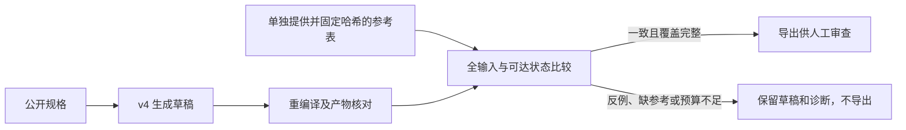

# 独立有限参考验收入口

这是 v3/v4 实验生成器之外的可选验收层。它根据外部提供的参考核对测试台，
不修改冻结生成器，不将参考答案送入模型，也不替换默认竞赛入口。



## 检查内容

1. 核对原始生成收据、公开题面、行为声明、匹配规则、输出约束和执行图。
2. 根据声明重新生成向量和 C++，要求与保存的实际产物一致。
3. 穷举有限参考的整个输入域；有状态时，探索“参考状态、生成契约状态”的
   可达组合。发现差异时保存从初始状态开始的最短输入反例序列。
4. 逐条检查实际测试向量。对未定义输出强行断言、遗漏应检查的输出、期望值错误，
   均不能进入已核对产物目录。有限比较完成仍不代表有限测试集能发现所有 DUT 故障。

参考采用完整的状态转移表；组合真值表是只有一个状态的特例。每行必须列出所有
输出，整数表示应有值，`null` 表示不作值断言。初态不明确时可显式设置 `unknown`
状态，在有公开依据的 reset 等操作之后才转入已知状态；不会默认补零。

参考上限为 256 个状态、4,096 种输入组合、65,536 行。默认比较预算为 4,096 个
可达状态组合和 65,536 次转移；超预算返回 `inconclusive`，不降级为抽样通过。
大位宽输入、数组、流、浮点和复杂协议需要其他参考适配器，目前不在此接口范围内。

## 使用保存的生成结果

从仓库根目录执行，`--output` 必须是新目录。`--oracle-sha256` 应取自独立固定的
参考登记记录；脚本不会信任参考文件内自报的内容哈希。

```powershell
python tools/review_bench4hls_testbench.py --problem public_problem.txt --top TopModule --generation output/example/generation --oracle independent_reference.json --oracle-sha256 <登记的SHA256> --output output/example_reference_review
```

参考 schema 和边界见 [设计协议](../../report/design/bench4hls_reference_gate_v1.md)。
缺少参考或外部哈希时保留 `needs_reference`；参考的题面、接口或哈希不匹配时为
`invalid_reference`。CLI 退出码 0 只表示 `reference_checked`，其他验收结果为 1。
参数错误由 argparse 返回 2。

| 状态 | 含义 | 导出 `checked/selftest.cpp` |
| --- | --- | --- |
| `reference_checked` | 与给定有限参考一致，且实际产物与检查覆盖通过 | 是，供审查 |
| `counterexample` | 声明或向量与参考冲突 | 否 |
| `needs_reference` | 未提供单独固定的参考 | 否 |
| `invalid_reference` | 参考结构、身份或完整性有问题 | 否 |
| `invalid_artifact` | 草稿、收据或中间产物无法验证 | 否 |
| `inconclusive` | 比较预算不足或测试覆盖不完整 | 否 |
| `abstained` / `generation_failed` | 原生成弃权或失败 | 否 |

每次审查保存 `report.json`、`inputs/problem.txt`、参考快照（若提供）和生成产物快照。
检查的是快照，导出的也是同一份已检查字节，原草稿不会被覆盖。

## 在生成后自动调用验收

API 为 `agent.selftest.bench4hls_reference_gate.generate_guarded_behaviors`。
它接受原 `generate_behaviors` 的公开输入和模型参数，另接收 `oracle_path`、
`expected_oracle_sha256` 及比较预算。先写 `draft/`，再写 `review/`，顶层
`result.json` 记录两阶段结果。模型的主提取、重试和盲提取均不接收参考或验收反馈。

该 API 需要显式使用；现有 legacy、v3/v4 runner 不会自动获得这层保护。
所有结果仍保持 `automatic_acceptance_allowed=false` 和
`repair_feedback_allowed=false`。核对通过不是无人值守的候选验收许可。

## 参考的信任边界

哈希证明使用了哪份参考，不能证明参考语义正确，也不能认证审核人。
`oracle_provenance_claim` 按原样记录来源和审核声明，不将其自动升级为可信审批。
历史独立评估参考仍标为 `evaluation_fixture`；语义切片仍为
`heuristic_unreviewed`，本轮没有将它们冒充人工审核契约。

有限比较针对给定参考与 Python 执行图。C++ 编译运行、变异检错、RTL、综合、
目标时钟及资源预算仍需独立验证。本轮历史回放不会新增这些证明。

实现：[验收模块](bench4hls_reference_gate.py)；工具：[单题审查](../../tools/review_bench4hls_testbench.py)、
[历史压力集回放](../../tools/replay_bench4hls_reference_gate.py)。
验证结果见 [72 次历史回放与能力边界](../../report/evaluations/bench4hls_reference_gate_v1_20260926.md)。
