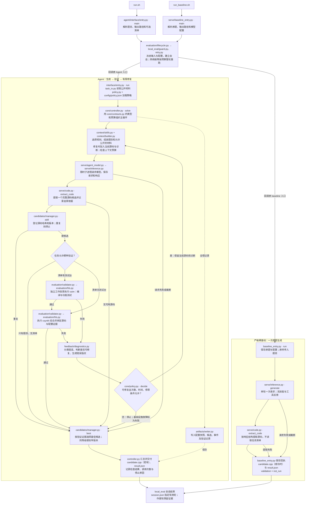

# Agent 与裸基线入口流程

核对日期：2026-09-18。以下路径均相对于 `zcomp/`。`run.sh` 进入 Agent；`run_baseline.sh` 独立完成一次原题生成，**不会进入 Agent 控制器或修复循环**。两条分支共用 `serve/inference.py` 的推理实现和 `serve/code.py` 的源码提取实现。

Obsidian 可编辑版本：[Agent 流程 Canvas](agent-flow.canvas)。画布文件链接以工作区 `ADMCmpt/` 为 Obsidian vault 根目录。

图中的外层按**原入口**执行回调，每次独立命令只运行对应分支；它不把 baseline 转交给 Agent。外层发现网络故障后可从头重跑整个命令，默认最多额外两轮。配对/批量命令由最外层统一重跑，子任务不各自开启重试；重跑耗尽时可能没有有效轮。移除 `local_eval/` 后，`evaluation/lifecycle.py` 直接执行一次回调。

## 模块职责与数据边界

| 模块 | 作用与边界 |
| --- | --- |
| [interface/entry.py](../../agent/interface/entry.py) | 解析 CLI，加载题目、配置和可选清单，装配模型、验证器、规则库和记录器；启动 `solve()` |
| [core/controller.py](../../agent/core/controller.py) | 执行生成、验证、修复循环，汇总结果；启动循环前预检工具环境；处理异常并在已有候选中收尾 |
| [core/contracts.py](../../agent/core/contracts.py) | 定义任务、公开材料、提示、诊断、验证结果、候选和时间预算，供模块交换数据 |
| [core/policy.py](../../agent/core/policy.py) 与 [config/policy.json](../../agent/config/policy.json) | 校验策略并判断是否继续修复；默认 `max_repairs=2`、停滞阈值 2、验证预留 30 秒 |
| [context/builder.py](../../agent/context/builder.py) | 加入题目、器件/时钟、显式允许公开的依赖；修复时加入当前候选及允许反馈；用 UTF-8 字节估计上下文预算，未做精确 tokenizer 核验 |
| [context/skills.py](../../agent/context/skills.py) | 按错误类别与关键词挑选 `skill/` 中的只读规则；默认关闭；不是 `rag/` 的 BM25/向量检索器 |
| [feedback/diagnostics.py](../../agent/feedback/diagnostics.py) | 从验证器已释放的反馈分类错误和计算指纹；不能自行读取未获准的详细测试信息 |
| [candidates/manager.py](../../agent/candidates/manager.py) | 源码去重、验证证据绑定与版本排名；每份新源码重新验证，同等级优先较早候选 |
| [artifacts/writer.py](../../agent/artifacts/writer.py) | 写入快照、候选、事件和结果；本目录是记录器源码，产物写入本次运行输出目录 |
| [serve/agent_model.py](../../serve/agent_model.py) 与 [serve/inference.py](../../serve/inference.py) | 前者提供 Agent 的限时模型子进程，后者实际请求兼容 OpenAI 的推理服务；响应截断仍判为失败 |
| [serve/code.py](../../serve/code.py) | 两条入口共用源码提取规则；Agent 可使用显式清单中的顶层函数信息，裸基线不额外读取清单；不通过逐块编译挑答案 |
| [evaluation/task_io.py](../../evaluation/task_io.py) | 读取显式题目、清单及依赖，检查路径和输入一致性，限定模型可见材料与验证阶段 |
| [evaluation/validator.py](../../evaluation/validator.py) 与 [evaluation/hls.py](../../evaluation/hls.py) | 为候选创建独立验证工作区，调用 Vitis 仿真/综合，控制超时并核验源码及配置；默认只释放错误类别，公开诊断须由清单允许 |
| [evaluation/lifecycle.py](../../evaluation/lifecycle.py)、[local_eval/guard.py](../../local_eval/guard.py)、[local_eval/retry.py](../../local_eval/retry.py) | 包裹整个评测会话，冻结输入、观察请求、标记作废轮与有效轮；网络重跑独立于 Agent 内部代码修复 |

## 如何理解结果

默认最多一次初始生成加两次修复，通过后立即停止。只提供题目时，生成候选后结束，不会自动生成测试台；有清单但无测试台时只综合；有测试台时先仿真，通过后再综合。每次修复得到的新代码都从该任务允许的第一个验证阶段重新开始。

Agent 退出 0 表示成功交付完整候选，可能仍未通过验证。需结合 `validation_scope`、`validation_status` 和 `checks` 判断；基础设施故障即使保留旧候选，仍返回失败。裸基线没有验证阶段，后续必须由独立评测检查代码才能比较通过率。图中模型调用、提取等异常支路可能没有候选可交付，回执会保留失败原因。

`run_paired.sh` 进入 [serve/paired_entry.py](../../serve/paired_entry.py)，冻结同一题目、模型配置、策略及运行编号，先执行裸基线，再启动独立 Agent，核对输入与回执哈希。**Agent 不复用 baseline 的初始代码**；配对完成也不代表两条分支通过功能验证。

`rag/` 当前独立运行，没有连入图中的上下文节点。使用与接入计划见 [RAG README](../../rag/README.md)。完整设计见 [设计说明](design.md)，归档分类见 [报告总索引](../README.md)。
