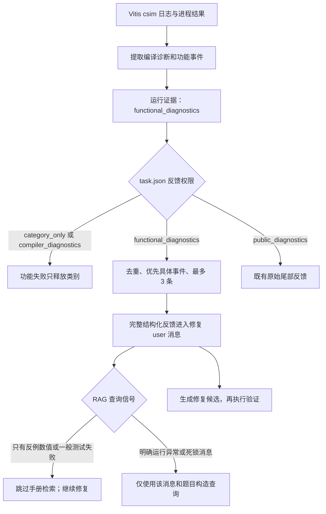

# 结构化功能诊断

实现目标：csim 功能失败时向已获准使用测试反馈的 Agent 提供具体事实，同时保持提取、权限和检索用途分离。没有修改数据集的现有反馈权限，没有扩大 hidden test 的可见范围。

## 启用方式

在允许向模型公开功能反馈的开发题 `task.json` 中设置：

```json
"feedback_policy": "functional_diagnostics"
```

这是任务清单字段，不是 Agent policy 字段。仍通过 `--task-manifest path/to/task.json` 加载；默认仍为 `category_only`。当前支持四档：

| 档位 | 编译／综合错误 | 功能失败 | 原始诊断尾部 |
| --- | --- | --- | --- |
| category_only | 类别 | 类别 | 不释放 |
| compiler_diagnostics | 已过滤具体诊断 | 类别 | 不释放 |
| functional_diagnostics | 已过滤具体诊断 | 有界结构化事实；无可提取信息时退回类别 | 不释放 |
| public_diagnostics | 原有诊断尾部 | 原有诊断尾部 | 明确放行 |

新档意味着测试所有者允许公开所提取的功能事件（包括日志中已有的期望值、实际值、输入和历史）；不是自动对隐藏测试进行脱敏。不要因为“结构化”就为未知权限的测试启用。新功能不修改现有清单。

## 实际提取什么

`evaluation/functional.py` 识别：

- `output_mismatch`：Mismatch 行中的 expected、got／actual、cycle／index、signal／output；字段没有出现就不添加。
- `assertion_failure`：明确的 Assertion failed 消息。
- `runtime_exception`：段错误、浮点异常、显式 C++ 异常终止、ASan／UBSan runtime error。
- `deadlock`：只有日志明确写出 deadlock detected 时记录；普通工具超时不推断成死锁。
- `test_failure`：测试失败汇总；可解析时保留日志报告的不匹配数、总用例数。
- `nonzero_exit`：日志明确报告的仿真程序非零退出值，与 Vitis 驱动进程 `tool_exit_code` 分开。

例如原始行：

```text
Mismatch at cycle 48: expected 1, got 0
```

产生的事件包含：

```json
{
  "failure_kind": "output_mismatch",
  "observed": {"expected": "1", "actual": "0", "cycle": 48},
  "truncated": false,
  "format": "text",
  "log_line": 1
}
```

expected／actual 保留字符串，避免把十六进制、宽整数等解释成错误的类型。输入与前序状态没有记录时，不根据期望输出猜测原因。

公开开发测试台可选择输出一行明确格式，提供普通日志缺失的输入／复位／历史：

```text
ZCOMP_FUNCTIONAL {"kind":"output_mismatch","cycle":5,"inputs":{"a":1},"reset":false,"expected":"7","actual":"0","history":[{"cycle":4,"inputs":{"a":0}}]}
```

解析器只接受预定义 kind 和字段白名单，不自动改写 Bench4HLS 测试台；普通日志中的任意邻接行也不会被当成输入历史。嵌套深度、条目数和字符串长度有上限，截断时标记 `truncated`。

## 信息流与预算



提取最多保留前 20 个不同事件，记录原日志行号、观测数和省略数。模型反馈最多 3 个不同事件，优先实际不匹配／异常，最长 2800 字符。过长事件整体省略，不截断 expected／actual 配对；上下文 builder 再按完整事件缩减，预算不足时明确退回类别及省略说明。源码和 system 不变。

`compiler_diagnostics` 不会收到这些事件；同时修正了“编译错误下一行恰好是功能日志时，被误当作源码附带释放”的边界问题。明确的 UBSan `runtime error` 不再误判成编译错误。外部超时、环境和许可证问题仍走原停止机制；没有修改修复次数或停滞规则。

## 与 RAG 的关系

新反馈首先服务于生成模型的功能修复。`diagnostic_v1` 不把 expected／actual、JSON 字段名或测试序号当作手册知识查询：只有明确的运行异常／死锁消息才继续检索，其余记录 `functional_feedback_without_manual_signal` 并继续无参考修复。旧 `legacy` 策略保留旧的全文查询行为，用于消融。

运行记录中，验证 outcome 的 `functional_diagnostics` 保存提取报告；`result.json.validation_history`／`events.jsonl` 随验证结果保留。模型真正看到什么应看该轮 `prompt.txt`、`request.json` 和 `context.json`，不能把内部完整证据当作已释放给模型的内容。

## 验证与后续

新增测试覆盖日志字段、缺失信息、运行异常分类、去重和限长、非法 JSON、反馈权限隔离、紧预算的完整事件、RAG 查询用途和本机 HTTP 修复请求。验证器／生成服务使用模拟，不调用远程 Vitis。测试日志：`output/functional_diagnostics_tests.log`。

原有诊断、Agent、基线、RAG 和生命周期回归一同复核。新功能的实际修复收益尚未实测。后续在明确允许公开反馈的开发集比较：compiler_diagnostics／functional_diagnostics × off／hybrid，固定首稿和预算；不要把两项变化混为单一 RAG 增益。

可编辑流程图：[functional-diagnostics-flow.canvas](../../docs/Mind/functional-diagnostics-flow.canvas)。

本轮结果：95 项相关回归通过，其中新增功能诊断测试 11 项；最终对新增 11 项复核也通过（`output/functional_diagnostics_final.log`）。

## Additional explicit testbench formats

The text parser also accepts `Fixed test error at cycle N`,
`Random test error at cycle N`, and `Error at test case N`, followed by
an explicit expected/got (or actual) scalar pair. Test cases use `index`;
cycles use `cycle`. Matching output labels such as `expected out=1, got out=0`
produce `signal: out` and separate value strings. Decimal, hexadecimal, binary,
boolean and floating-point scalar values are supported. Unrelated prefixes,
incomplete pairs and conflicting output labels are rejected. Free-form input
prose is not reconstructed; use `ZCOMP_FUNCTIONAL` for structured inputs/history.
These events share the existing category classification, compiler-block exclusion,
release-policy and whole-event budget handling. Dataset policies remain unchanged.
