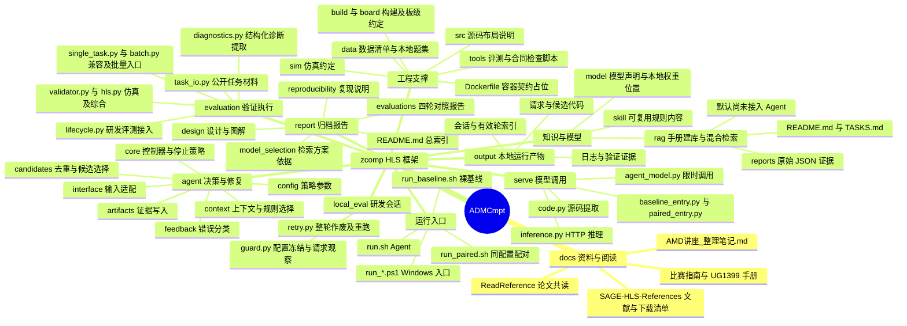

# 项目结构思维导图

核对日期：2026-09-18。以 `F:/Projects/ADMCmpt` 为工作区根目录，`zcomp/` 为 Git 仓库及框架根目录。图中按职责组织真实路径；省略包标记、缓存、编辑器配置和临时目录。

Obsidian 可编辑版本：[项目结构 Canvas](project-structure.canvas)。画布文件链接以工作区 `ADMCmpt/` 为 Obsidian vault 根目录。

`src/` 是源码布局说明，当前 Python 实现分布在 `agent/`、`serve/`、`evaluation/` 等目录。`agent/artifacts/` 和 `agent/candidates/` 保存管理代码，实际运行数据写入输出目录。

`skill/` 的规则内容由 `agent/context/skills.py` 读取，默认关闭。`rag/` 提供独立的手册检索能力，当前并未接入 Agent 默认修复链路。`build/`、`board/`、`sim/` 主要说明约定，不能据此认为已有完整构建、板级部署或离线容器。

本地题集、权重、语料、向量与运行产物按 Git 忽略规则保存；图中出现目录不代表其内容应提交。显式输出路径也可以由用户指定。原 `record/` 和 `zcomp/record/` 中的报告已集中迁入 `report/`，不再作为报告归档入口。

继续阅读：[Agent 入口与模块流程](agent_flow.md) · [报告总索引](../README.md) · [项目说明](../../README.md)。
