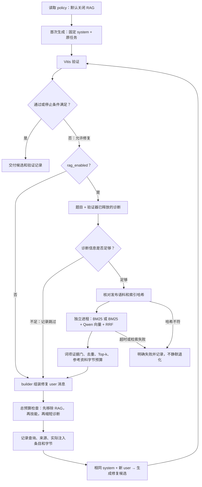

# UG1399 接入 Agent 修复流程

2026-09-19，分支 `feat/rag`。本版完成任务 B6：复用现有 UG1399 英文 2025.2 语料、Qwen3-Embedding-0.6B、BM25／混合检索。默认关闭，仅在验证失败且策略允许修复时检索；首次生成和严格裸基线不加入 RAG。官方示例、Vitis Libraries、案例采集与论文迁移仍是后续任务。

当前策略已更新为 `diagnostic_v1`：低信息诊断跳过，诊断优先查询，候选先过词项门；见 [首轮复盘与改进](rag_repair_v2.md)。末尾验证数字保留初版历史记录。

## 程序流程



可编辑画布：[rag-agent-flow.canvas](../../docs/Mind/rag-agent-flow.canvas)。已有 [RAG.canvas](../../docs/Mind/RAG.canvas) 同步说明当前连接状态。

## 职责与边界

| 模块 | 作用 |
| --- | --- |
| `agent/context/retrieval.py` | 读取独立路径配置；仅从 `TaskSpec.problem` 和 `Diagnostic.feedback` 构造查询；启动有超时的检索进程 |
| `rag/release.py`、`rag/releases/*.json` | 显式选择一个冻结的 reference 发布条目；检查语料、索引与 manifest 哈希，禁止指向 staging |
| `rag/worker.py` | 复用 `Retriever`，拒绝包含 pending／withdrawn 或非参考角色的语料，输出原文和来源 |
| `agent/context/builder.py` | 将参考加入 user 的 `<REFERENCE_MATERIAL>` 区；先丢弃完整参考，再退技能和诊断；题目、源码、system 不截断 |
| `agent/core/controller.py` | 仅修复阶段调用检索，保存运行证据，复用原有验证和停止策略 |
| `serve/paired_entry.py`、`local_eval/guard.py` | 配对与研发重跑时冻结 RAG 路径配置、发布文件、语料／索引及混合模式模型文件 |

反馈权限完全沿用验证器：`category_only` 只允许错误类别；`compiler_diagnostics` 使用已过滤的编译／综合错误；`public_diagnostics` 使用该策略明确放行的内容。检索不自行读取日志、测试台、隐藏答案或候选源码。长查询保留题目和诊断两部分，并记录截断标记与原始输入哈希。

这里的“发布”表示允许作为参考，不表示 HLS 验证通过。UG1399 条目保持 `release.status=reference`、`validation.status=unvalidated`。当前发布入口是单个明确指定的注册条目，不扫描目录自动纳入其他语料。底层 `rag.retrieve` CLI 仍是开发检索工具，允许显式检查任意语料；Agent 必须经过发布门。

## 如何启用

在仓库根目录运行；题目、清单和生成服务配置替换为实际路径，输出目录须是新目录：

```powershell
python -B -m agent.interface.entry path/to/problem.txt output/rag_run_01 --config serve/runtime.local.json --task-manifest path/to/task.json --policy agent/config/policy.rag-hybrid.json --rag-runtime rag/runtime.local.json
```

配对入口 `python -B -m serve.paired_entry` 支持相同的 `--policy`、`--rag-runtime` 参数。取消 `--policy` 即恢复默认关闭；旧版没有 RAG 字段的 policy 也按关闭处理。BM25 对照可复制启用配置，仅将 `rag_mode` 改为 `bm25`；此时不加载 Embedding 模型。

`rag/runtime.json` 是可移植模板；本机 `rag/runtime.local.json` 被 Git 忽略，包含：

```json
{
  "registry": "rag/releases/ug1399-2025.2-en.json",
  "python": "F:/Workspace/hls-rag/venv/Scripts/python.exe",
  "model": "F:/Workspace/hls-rag/models/Qwen3-Embedding-0.6B"
}
```

配置优先级：显式 `--rag-runtime` → 本机文件 → 模板。相对路径基于仓库根目录；换电脑需放置相同发布语料／索引并修改本机配置。模板的空模型路径不能用于混合检索。没有验证材料的运行不会触发修复，因此也不会产生检索调用。

默认每路召回 20 条、最终最多 2 条、参考区含包装不超过 2400 UTF-8 字节；查询最多 1600 字符。每次检索最多 30 秒，并扣除剩余总时间与验证预留。Qwen 运行在本地 CPU，worker 每次修复重新加载；后续可用常驻服务减少冷启动，但本版优先保证独立进程可超时终止。未增加模型重排器，混合排序仍是 RRF。

超时、哈希变化、离线模型不可用都显式记为失败并停止本轮；不会伪装成成功的无 RAG 实验。合法检索没有命中或参考被预算全部移除时可以继续修复，记录 `no_reference_injected`。总提示预算沿用保守字节估计，不宣称精确 token 计数。

## 如何查证

- 运行根目录 `rag.json`：开关、实际路径、发布信息与配置指纹。
- `candidates/001/retrieval.json`：查询、反馈权限、截断情况、召回与实际注入 ID、corpus／index 指纹、耗时与错误。
- `retrieval_input.json`／`retrieval_output.json`／`retrieval.log`：检索进程输入、原始结果和日志。
- `context.json`、`request.json`：最终注入字节、条目及实际模型输入；`result.json.rag_history` 和 `events.jsonl` 保存检索轨迹。

经过研发评测管理入口时，这些文件位于该轮 `session.json` 指向的有效 attempt 的 `result/` 内。引用来源应查看候选目录，不能把召回但被预算丢弃的条目当成模型已看到的证据。

## 验证范围

78 项 Agent／基线／评测生命周期／诊断／RAG／回执测试通过（其中新增 RAG 契约 11 项、回执写入 2 项）。日志：`output/rag_contract_final.log`。本地协议测试覆盖默认关闭、修复阶段注入、反馈权限、待审隔离、哈希变化、超时、预算和真实 HTTP 请求中的参考区。检索层另有 10 项工程测试通过，合计 88 项；日志：`output/rag_retrieval_verification.log`。

回归期间定位到 Windows 短暂文件占用导致原子替换回执失败；仅对该重命名操作增加最多 150 毫秒的等待重试，持久失败仍报错，不重试模型请求。既有微秒超时测试改用确定性预算注入，避免依赖 Windows 时钟分辨率。

已完成真实 UG1399 + 本地 Qwen 的完整修复链路 smoke：初始请求无参考；修复请求注入 3 条、4216 字节，首条为第 154 页 Recursive Functions；检索进程约 7.72 秒。记录在 `output/rag_ug1399_agent_smoke_20260919/`。生成服务为本机模拟 HTTP，验证器为 FakeValidator，**未调用真实 Vitis，也不能据此宣称修复成功率提升**。

后续用固定首稿、相同反馈与预算比较关闭／BM25／hybrid，并在远程 Vitis 完成真实验证。
