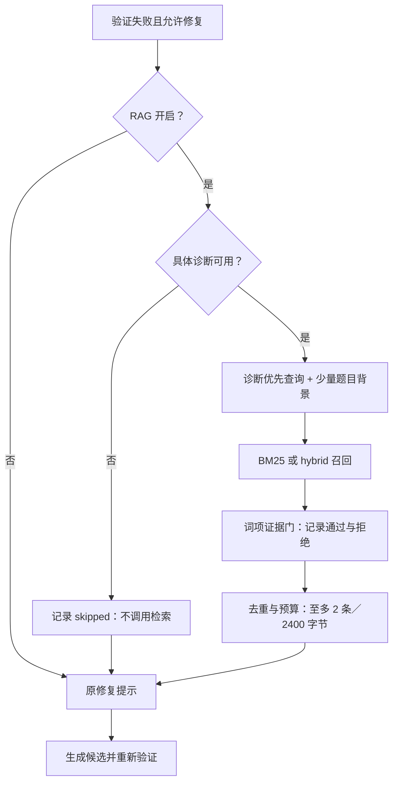

# Bench4HLS 首轮 RAG 复盘与改进

依据：[2026-09-19 原始测评记录](../../record/9-19-Bench4HLS-RAG-compare.md)。该记录报告 off／BM25／hybrid 分别通过 112／111／109 题。本机没有记录中引用的原始远程结果目录，未逐题复核，不重新解释或覆盖历史结果。

## 结论的边界

本次配置未显示 UG1399 修复检索的总体收益，抽查发现无关参考注入。仅凭净减少 3 题不能确立因果或显著性；hybrid 是不同排序方式，不是“检索强度”递增。compile 总数相同不代表通过集合相同，也不能证明编译修复没有空间。综合通过数还受前置 csim 是否通过影响。

现有 builder 先丢弃 RAG，源码不会被截断。参考占 84% 篇幅支持“可能有干扰”的假设，不能证明参考挤掉了代码或造成失败。工具超时可能受并发影响，不能一律称为确定性失败。

## 需要修正的实验设计

独立生成首稿，确认正常结束、源码提取成功后冻结候选源码和哈希。三条件全部从该源码开始验证／修复，使用相同并发、配置和时间预算。首稿无效在三条件一致记为无有效首稿，不重新生成，也不接受只有 response.txt 的截断响应。

首稿生成成本独立记录；修复条件耗时包括重新验证首稿、检索、生成与验证。固定配置和输入哈希；命令行指定的 RAG runtime 必须实际用于两种检索条件。报告任务级胜／负／平集合和有效首稿上的恢复率，另保留全量端到端分母与基础设施失败。

temperature=0 不独自保证跨调度复现；比较时保持同硬件、版本和并发。需要时复测差异题并统计多次结果，不能挑选最好一轮。参见 [vLLM 可复现性说明](https://docs.vllm.ai/en/stable/usage/reproducibility/)。

## 本轮实现范围

- [x] 修正固定首稿比较、实际路径传递和发布输入冻结。
- [x] 低信息诊断门：只有错误类别时跳过检索，保留修复与审计记录。
- [x] 查询以已释放的具体诊断为主，清理位置噪声／重复，题目只保留少量背景。
- [x] 在候选截选之前应用可解释的词项证据门；不把 RRF／余弦分数称为可信度。
- [x] 默认最多 2 条、2400 UTF-8 字节；保留完整片段，预算放不下时不强行截断。
- [x] 保留 legacy 策略用于消融，补契约测试和可编辑流程图。

词项门是保守工程启发式，可能错拒同义表达，也可能接受表面重合；不是已校准的语义相关性判断。它必须记录通过／拒绝原因，并通过后续人工标注进一步校准。关闭 RAG 的请求保持不变，首稿与 system prompt 不变。检索仍只使用题目与当前验证器释放的反馈，不读原始日志、源码或隐藏测试。

## 后续独立实验

1. 先用开发集标注“知识是否存在、是否召回、是否被选中”。只有召回包含正确证据而排序不佳时再优先尝试重排模型。
2. 功能反馈改进单独做 2×2：当前／允许公开的结构化反例 × off／改进 hybrid。未获准公开的测试反例不能释放，也不能进入发布库。
3. 检查功能错误类别恒定时的停滞判断，单独做消融，不与本轮 RAG 变更混为一个收益。
4. 补独立验证的位宽、位选择、状态、复位、FSM、Verilog/C++ 语义示例；保留适用条件、完整源码、来源、工具版本与验证范围。不能把评测题答案写入库后继续宣称同题泛化效果。
5. 常驻 Embedding 服务减少冷启动；独立验证并发、超时和资源占用，不静默改变现有失败语义。

本轮不更换模型、不扩大知识库、不开放功能反例、不改变停止策略。优先验证门控和小预算是否减少无关注入及退步题；收益需要远程 Vitis 新实验确认。

## 已实现的配置和证据

`rag_strategy=diagnostic_v1` 是当前 Agent 默认策略。`rag_mode` 继续选择 bm25／hybrid；全局 `rag_enabled` 仍默认 false。发布语料和 Qwen 权重没有变更。

查询清理编译器文件位置、时间戳及重复行，将 error 行优先，题目最多占 256 字符且不超过可用查询长度的四分之一。候选在 Top-k 截选之前经过词项门：至少命中两个诊断有效词；出现明确的 missing member 时还必须包含该成员名。该门只证明词项对应，**不证明条目提供有效修复**。完整原文保持不变，放不下的小预算会导致不注入，而非截断正文。

`query_plan` 记录策略、诊断词和必要成员名；`selection_audit` 记录候选的词项匹配和通过／拒绝原因。`accepted` 仅表示通过词项门，实际模型是否看到该条仍以 `injected_ids` 为准。低信息反馈记录 `status=skipped` 和原因，不启动检索 worker；合法无命中继续修复。真正的超时／发布校验失败仍明确报错。

旧行为消融：将完整策略副本中的 `rag_strategy` 设置为 `legacy`，并显式恢复 `rag_top_k=3`、`rag_max_bytes=6000`；仅修改 strategy 不会恢复旧预算。不要在同一个对照里同时修改反馈权限或停止规则。

## 对照实验运行方法

在实际安装 Vitis 和生成服务的运行环境中执行；路径按部署调整：

```powershell
python -B tools/run_rag_compare.py --dataset data/processed/bench4hls --config serve/runtime.rag-eval.json --policy agent/config/policy.rag-hybrid.json --rag-runtime rag/runtime.local.json --workers 1
```

脚本按现有 selection 规则选择任务，运行前应核对选择文件；summary 的 task_count、drafts 与 results 给出实际范围。单题检查可增加 `--task Prob072`。

新协议名为 `fixed_draft_v2`：先生成一次并验证首稿（max_repairs=0），再让所有条件复用冻结的 `initial.cpp`。生成失败统一记录 `no_valid_initial_source`，不调用三组模型重新生成。三组 policy 由一个公共配置派生，仅开关和模式不同。默认统一 workers=1；workers>1 仍不宣称确定性输出。显式 runtime 用于全部检索条件；语料发布预检在首稿生成前完成。

首稿阶段成本在 `drafts`；三组耗时不含首稿生成，包含重新验证首稿与完整修复。summary 保留全量分母、恢复任务集合以及逐题 `paired_vs_off.wins/losses/ties`；恢复分母只计算有有效首稿且首轮为可修复失败的任务，排除工具／环境故障。参数、runtime 和源码快照保存哈希，运行后核对；研发外层同时冻结已发布语料／索引和 hybrid 模型文件。

## 本地验证与限制

- 92 项 Agent／RAG／评测脚本／诊断／生命周期等协议测试通过：`output/rag_v2_contracts.log`。检索层 10 项通过：`output/rag_v2_retrieval_contracts.log`。首稿预检调整后另复核评测脚本测试。
- 真实 UG1399＋本地 Qwen 抽查：递归综合错误只保留 Recursive Functions（922 字节）；缺少 parity 成员的诊断未找到通过词项门的证据，返回空参考；纯功能类别跳过检索。证据：`output/rag_v2_real_retrieval.json`。这些是开发 smoke，非独立标注集的准确率。
- 本地两个 manifest 曾因 CRLF 与发布库 LF 哈希不符而被正确拒绝；只在确认转为 LF 后逐字节匹配既有发布哈希时修复本地文件。没有修改发布注册表、正文、向量或放宽校验。
- 本轮未启动远程 170 题新测评，不能宣称通过率提升。待用固定协议复测，并按独立开发／评估划分验证。

## 程序流程图



可编辑画布：[RAG 修复流程](../../docs/Mind/rag-agent-flow.canvas) · [固定首稿对照实验](../../docs/Mind/rag-compare-flow.canvas)。

后续实现：已新增显式启用的 [结构化功能诊断](functional_diagnostics.md)，实际对照收益仍待验证。
